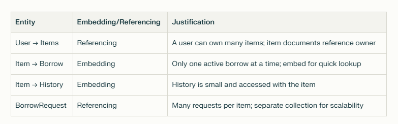

<div align="center">

# OpenShelf


**A community-driven digital lending library for books, tools, and games.**

</div>

## Features

### Homepage & Navigation
- [ ] Display item categories (books, tools, games) with featured listings
- [ ] Search bar functionality for name, category, or keywords
- [ ] Guest browsing with prompts to log in for full access
- [ ] Responsive design for all device types

### Authentication
- [ ] User registration with email/password or Google OAuth
- [ ] Secure login system with session management
- [ ] Account confirmation and verification process
- [ ] Password reset functionality

### Browse & Search
- [ ] Advanced filtering by category, availability, and location
- [ ] Real-time search with keyword matching
- [ ] Item cards displaying title, image, and availability status
- [ ] Pagination for large result sets

### Item Management
- [ ] Detailed item view with description, condition, and owner info
- [ ] Add new items with photos, descriptions, and categories
- [ ] Edit and update existing item listings
- [ ] Set item availability and lending terms

### Borrowing System
- [ ] "Request to Borrow" functionality for available items
- [ ] Borrowing terms confirmation (duration, return date)
- [ ] Borrow request tracking and status updates
- [ ] Borrowing history and current loans dashboard

### Lending Management
- [ ] Receive and review incoming borrow requests
- [ ] Approve or decline requests with messaging
- [ ] Track items currently on loan
- [ ] Item return acknowledgment system

### Notifications & Messaging
- [ ] Real-time notifications for request updates
- [ ] Due date reminders for borrowed items
- [ ] In-app messaging between lenders and borrowers
- [ ] Email notifications for important updates

### Profile Management
- [ ] Personal profile with contact information
- [ ] Borrowing history and statistics
- [ ] Lending history and item management
- [ ] Account settings and preferences

### Security & Compliance
- [ ] Item validity verification system
- [ ] Platform policy compliance checks
- [ ] Secure data handling and privacy protection
- [ ] User rating and review system


## User Stories
- As a user, I can list items I own and am willing to lend.
- As a user, I can request to borrow items.
- As an owner, I can track who has what and when it's due back.

## Database Schema



## Getting Started
To get started with OpenShelf, follow these steps:

1. **Clone the repository.**  
   Make sure you have the proper access to the repository and your SSH keys are set up correctly.
   ```bash
   git clone git@github.com:freeCodeCamp-2025-Summer-Hackathon/OpenShelf.git

   ```
2. **Navigate to the project directory:**
   ```bash
   cd OpenShelf
   ```
---

<div align="center">
  This project is part of the <strong>freeCodeCamp 2025 Summer Hackathon</strong>, created by <strong>Team Lavender</strong>.
</div>